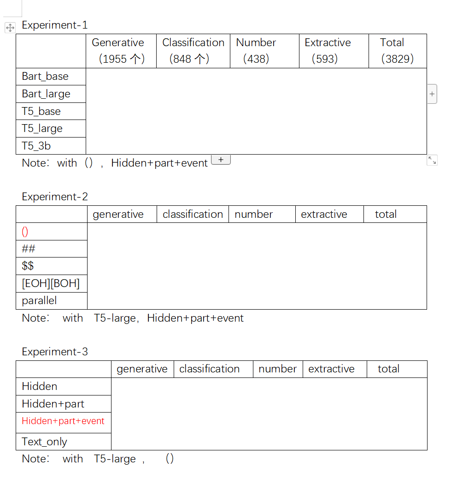

# ITNLP_Semeval2022_Task6
#### **[This project is for semeval 2022 Task9](https://competitions.codalab.org/competitions/34056#participate)**

#### The following will illustrate this work from data processing,  experimental code and experimental data.

## data processing

If you need to try it yourself, you may need to modify some file paths under utils.py,for example:

```

#  The original data path
crl_srl_path = {
    "Train": r"train\crl_srl.csv",
    "Val": r"val\crl_srl.csv",
    "Test": r"test\crl_srl.csv"
}

# The path to save the file
text_tag_file = {
    "Train": r"data/train_all_text_tag.json",
    "Val": r"data/val_all_text_tag.json",
    "Test": r"data/test_all_text_tag.json"
}
```

You may wish to extract different combinations of tags, which can be modified at the end of the utils.py file, The second parameter indicates the tags you need ,like "'hidden','participant','entity'", it must be a tuple.

```
for key, value in text_tag_file.items():
    merge_process(key, ('hidden','participant','entity'), value)
```

In fact, we have uploaded some processed experimental data in the datasets directory. The QAs directory is the question-and-answer pair, and the other directories are the corresponding text data.

## experimental code 

In the code directory, there are codes for three experiments. The descriptions of these three experiments are as follows: 

Therefore, there are three folders in the code directory, corresponding to the codes of the three experiments.




In order for the program to allow it, you may need to tie some paths:

```
#  Adjust batchsize according to your own video memory size
batchsize = 4

# Make an appropriate choice according to whether your model is T5 or Bart, and modify 
# the model path at the same time
model, tokenizer = get_premodel(type='T5', path=r"/data/home/acw664/number_reasoning/t5")

# Modify the path of the question and answer pair, modify the path of the text
#If you use hidden, part, event three attributes, you need to pass in the data of two #files.
#If only hidden or hidden+part is used, only one file data is required
#Specific reference to different experimental codes

train_dataloader, validation_dataloader = get_dataloader(tokenizer,                                                     train_qa_path="datas/QAs/train_qa.json",                                                 train_text_path=r"datas/data3/data/train3.json",                            			  train_text_path_entity=r"datas/data3/entity/train3.json",                                 
							  val_qa_path="datas/QAs/val_qa.json",                 									  val_text_path=r"datas/data3/data/val3.json",
							  val_text_path_entity=r"datas/data3/entity/val3.json",
							  batchsize=batchsize)
							  
							  
							  
training_logs = train(model, tokenizer, train_dataloader, validation_dataloader,
                      save_path=r"save")
train_summary(training_logs)
```

In our attempts, we recommend a learning rate of 1e-5 for T5's model and 2e-5 for Bart's model


In addition, it should be noted that the model of T5-3b is too large, and we have parallelized it on multiple GPUs. For details, please refer to the code or [hugging face](https://huggingface.co/docs/transformers/model_doc/t5)


Finally, we show our experimental results under the experiment_result path


